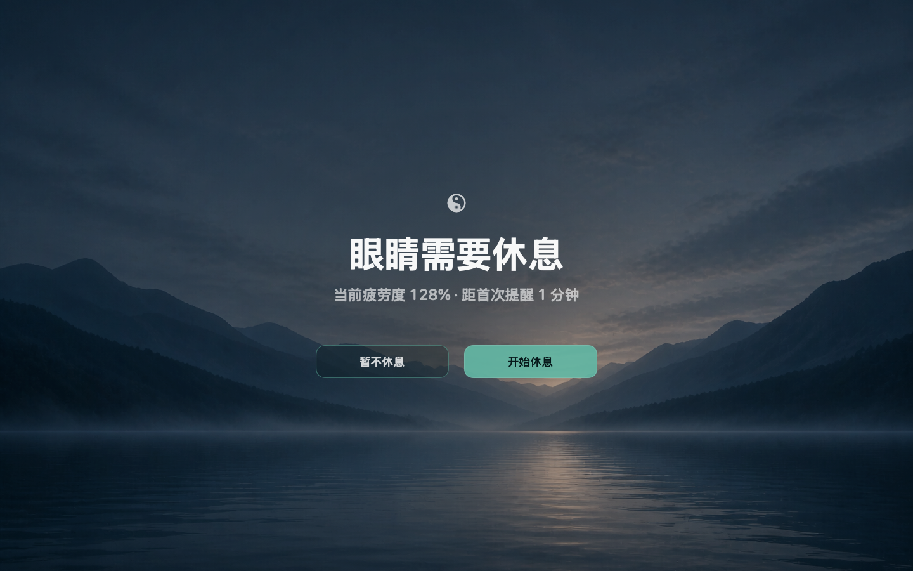
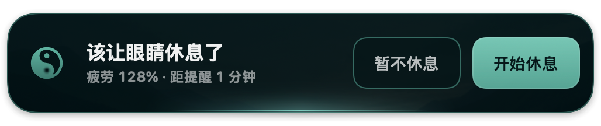
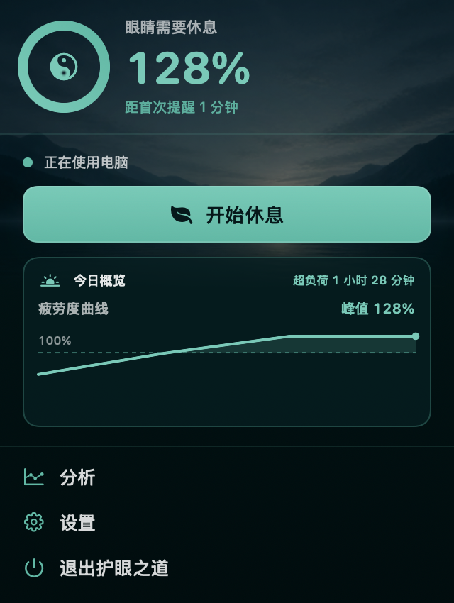
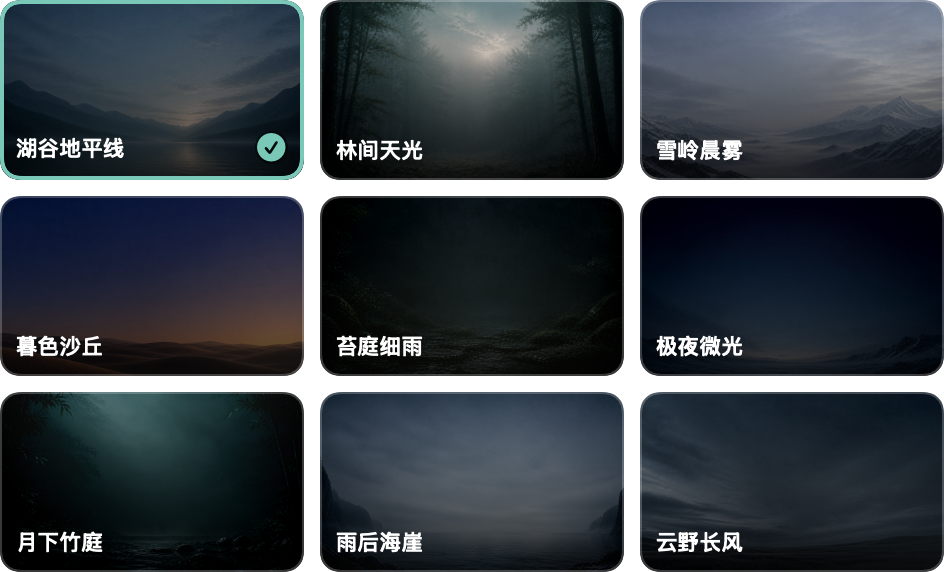

# GazeEase

English · [简体中文](README.zh-CN.md)

A quiet macOS menu bar companion that reminds you to take a break and shows how your computer use adds up through the day.

## A small pause, on your terms

- **Your rhythm:** by default, 20 minutes of effective use leads to a 20-second rest. Both durations are adjustable.
- **Your reminder:** choose a quiet system notification, a top prompt, or a full-screen reminder.
- **Your atmosphere:** nine nature-inspired themes across the app, with optional automatic random rotation.
- **Your daily picture:** see today's fatigue curve, peak fatigue, and time above 100%—stored and processed locally.

### A gentle reminder

Start a rest or choose **Not Now** and keep working.

### Your day at a glance

Open the menu bar panel to see today's curve and overload time.

### Find your quiet place

Choose one of nine themes, or let them rotate automatically.

Screenshots show the Chinese interface with demonstration data, not a user's activity history.

How fatigue and rest work

- Fatigue is a timer-based estimate, not a medical measurement. The configured use interval corresponds to 100%; continued use can take it higher.
- After **Not Now**, a reminder returns at each newly reached 100% multiple. If partial rest brings fatigue below 100%, reminders pause until it reaches 100% again.
- Starting rest covers all displays. Input interrupts it, but recovery so far is kept. A complete uninterrupted rest resets fatigue to zero.
- Locking the screen or sleeping can count as rest. Automatic rest after prolonged inactivity is optional; ordinary stillness alone does not count by default.
- Changing the use interval recalculates fatigue from accumulated effective use. Settings and fatigue state survive app restarts.

## Privacy

Input Monitoring is used to detect activity and rest interruptions—not to record what you type. GazeEase does not request Screen Recording, store screen content or key contents, or send telemetry. All processing and storage stay on your Mac. [Read the privacy statement →](PRIVACY.md)

## Download the test build

**[Download for macOS →](https://github.com/swaydong/GazeEase/releases/download/v1.1.0-test.40/GazeEase-1.1.0-build40-macos-test.zip)** · Version `1.1.0`, Build `40` · [Release notes](https://github.com/swaydong/GazeEase/releases/tag/v1.1.0-test.40)

Requires macOS 14+; includes Apple silicon and Intel builds. No Xcode needed: extract the ZIP, drag `GazeEase.app` into Applications, and open it there.

This is an **Apple Development-signed, unnotarized prerelease**, not a Developer ID-notarized release. macOS may block its first launch; only use Apple's **Open Anyway** flow after verifying that the download is from this official release and has not been altered. A separate clean Mac has not yet been tested, so compatibility is not guaranteed. [Installation, security warnings, and limitations →](INSTALL.md)

### Build from source

For development, use macOS 14+ and Xcode 16+. Open `EyeProtection.xcodeproj`, select your own Team and a unique Bundle Identifier, then build and grant Input Monitoring when prompted. [Development setup and tests →](CONTRIBUTING.md)

## Open source

Source code is available under the [MIT License](LICENSE). Theme artwork, brand assets, and derived screenshots have a separate, limited license in [ASSETS.md](ASSETS.md); **MIT does not cover these visual assets**.

Ideas, bug reports, and focused contributions are welcome. [Contributing →](CONTRIBUTING.md)
